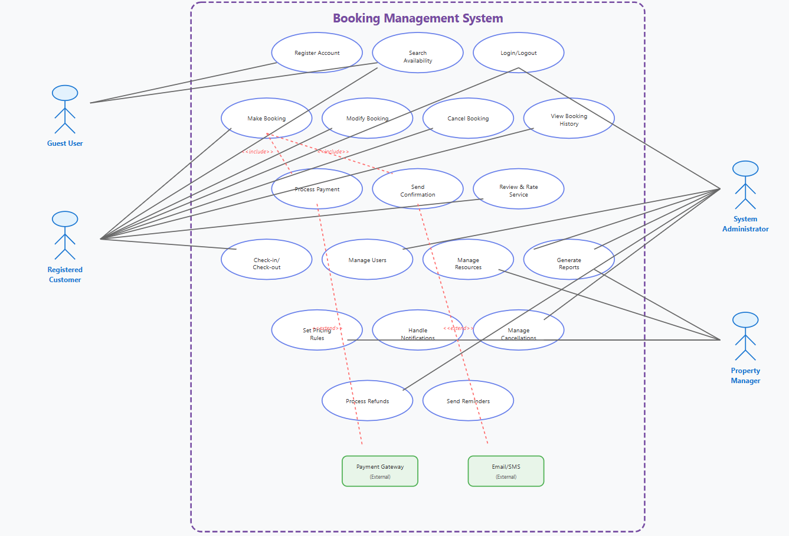

# Requirement Analysis in Software Development

## 0. Introduction
This repository focuses on the **Requirement Analysis** phase of software development.  
It uses a **Booking Management System** as a case study to illustrate how to gather, analyze, and document requirements effectively.  
Requirement Analysis ensures that project goals, user needs, and technical constraints are clearly defined before development begins.

---

## 1. What is Requirement Analysis?
Requirement Analysis is the process of identifying, documenting, and validating what a software system needs to achieve.  
It is one of the most critical stages in the **Software Development Life Cycle (SDLC)** because it sets the foundation for design, implementation, and testing.

###  Key Goals:
- To understand what the client and users expect from the system.  
- To define *functional* and *non-functional* requirements.  
- To minimize misunderstandings, rework, and project risks.  

Without proper requirement analysis, projects risk **scope creep, budget overruns, and delivery delays**.

---

## 2. Why is Requirement Analysis Important?

Requirement Analysis is crucial because it:

1. **Prevents Miscommunication** — Ensures all stakeholders share the same understanding of project goals.  
2. **Improves Project Planning** — Helps estimate time, cost, and resources accurately.  
3. **Reduces Risks and Rework** — Identifies potential issues early before coding begins.  
4. **Improves Product Quality** — Ensures the final product aligns with business and user expectations.  
5. **Defines Clear Acceptance Criteria** — Sets measurable conditions for completion.

---

## 3. Key Activities in Requirement Analysis

The process involves five major activities:

1. **Requirement Gathering**  
   Collecting information from stakeholders through interviews, surveys, and observation.

2. **Requirement Elicitation**  
   Refining and expanding gathered information to understand user expectations clearly.

3. **Requirement Documentation**  
   Recording all functional and non-functional requirements in structured formats like SRS (Software Requirement Specification).

4. **Requirement Analysis and Modeling**  
   Identifying dependencies, conflicts, and visualizing the system with models or diagrams.

5. **Requirement Validation**  
   Reviewing requirements with stakeholders to ensure completeness and accuracy.

---

## 4. Types of Requirements

###  Functional Requirements
These describe **what the system should do** — its features and functionalities.

**Examples (for Booking Management System):**
- Users can **search** for available rooms by date, location, or price.  
- Users can **book** a property and receive an email confirmation.  
- Admins can **add, edit, or delete** property listings.  
- The system should **process payments** via credit card or PayPal.  
- The system should **generate booking reports** for admins.

###  Non-Functional Requirements
These describe **how the system performs** — its quality attributes and constraints.

**Examples:**
- The system should respond to user actions **within 2 seconds**.  
- The platform should handle **up to 10,000 concurrent users**.  
- All user data should be **encrypted using HTTPS/TLS**.  
- The system should maintain **99.9% uptime**.  
- The UI should be **accessible (WCAG 2.1 compliant)**.

---

## 5. Use Case Diagrams

Use Case Diagrams visually represent the interaction between **actors** (users) and **the system**.  
They help developers and stakeholders quickly understand what features users can perform.

###  **Actors for the Booking Management System:**
- **Guest (User)**
- **Admin**
- **System**

###  **Example Use Cases:**
- Search for Property  
- Book Property  
- Make Payment  
- View Booking History  
- Cancel Booking  
- Manage Listings (Admin)  
- Generate Reports (Admin)

###  Use Case Diagram
Below is the use case diagram illustrating these interactions:

---

## 6. Acceptance Criteria

Acceptance Criteria are the conditions that a feature must meet to be accepted by stakeholders.  
They serve as checkpoints for validation and testing.

###  **Example: Checkout Feature**

**Feature:** User completes a booking and pays successfully.

**Acceptance Criteria:**
1. User selects a property and clicks “Book Now.”  
2. The system displays a checkout form with booking details.  
3. User enters payment information and confirms.  
4. Payment is processed successfully.  
5. User receives a confirmation message and email receipt.  
6. The booking appears in the user’s booking history.

These criteria ensure the feature functions correctly from end to end.

---

##  Conclusion

Requirement Analysis acts as the **blueprint of success** for any software project.  
It ensures that all stakeholders align on *what* the system should do and *how* it should behave, preventing costly rework later.

By defining clear requirements, visualizing use cases, and setting acceptance criteria, we create a strong foundation for smooth project execution.

---

##  Repository Info
**Repository Name:** requirement-analysis  
**Author:** *Idowu Shola Adelakun*  
**Date:** 26 October 2025  
